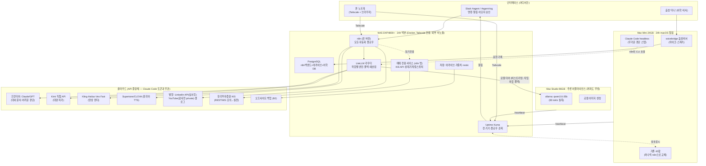

# 시스템 아키텍처 v3 — 확정판 (2026-07-22)

> v2/v2.1을 대체한다. v3는 **병렬 웹검증 4종**(NAS/UGOS 실사용 · 한국 증권사 API · n8n/LiteLLM 스택 · 영상/퍼블리싱 API)과
> **내부 결함 공격 12항**을 통과한 결과다. 모든 수치·제약은 출처 교차확인됨(§8 검증 대장).

---

## 1. 확정 아키텍처

**핵심 성질**
- **끊김 없음**: 자동화 본체는 NAS(API 종량제). Claude Code 토큰 소진·스튜디오/미니 다운과 무관하게 동작.
- **로컬 티어 = 스튜디오 단독** (검증: NAS CPU로 LLM 생성 시 5코어 포화→백본 질식 / 미니는 이미 40잡+음성으로 압박).
- **스튜디오는 어플라이언스**: 꺼지면 LiteLLM이 클라우드로 자동 폴백. 시스템의 기둥이 아님.
- **미니는 교살자 전략**: n8n 플로우 검증 → 대응 잡 OFF("켜기 전에 끈다" — 이중발송 방지) → 마지막에 celery/slackbot 정리.

## 2. 검증으로 확정된 구현 규칙 (어기면 사고나는 것들)

### NAS/UGOS (판정: UGOS 유지 + 주의사항, 플랜B 확보)
- 컨테이너 전부 `restart: unless-stopped` (월례 OS 업데이트가 Docker 재시작·간헐 권한 리셋).
- UGOS 자동 업데이트 OFF → 월 1회 수동 적용 + 컨테이너·권한 사후 점검(런북 항목).
- 텔레메트리 옵트아웃 + DNS 차단. 포트 53은 호스트 점유(주의). 외부 노출 0, Tailscale 전용.
- compose·볼륨은 데이터 볼륨(/volume1)에, compose는 git 관리(호스트 불가지론 — 미니 Docker로 이사 가능).
- 플랜B 공식 확인: TrueNAS/Debian 설치해도 하드웨어 보증 유지. RAM 64GB까지 공식.

### n8n + LiteLLM
- n8n: **Postgres 백엔드 D2부터**(SQLite는 정전·동시쓰기 파손 함정 — v2.1의 SQLite 결정 번복). Redis/큐모드 불필요. 이미지 핀 + 업그레이드 전 워크플로 JSON 내보내기. 플로우 12개 상한.
- LiteLLM: 버전 핀 + 메모리 상한 1GB + 재시작 정책(메모리릭 이력). **ollama 폴백은 비스트리밍 고정**(stream=True 폴백 실패 버그) + 타임아웃 ≥15s(콜드스타트).
- 엔진 구성: Claude/OpenAI/Kimi(직접 API, K2.5 $0.6/$3 저가 티어) + ollama@studio. OpenRouter는 충전 수수료 5.5%·로컬 불가 → 실험용 업스트림으로만.
- 예산: 월 상한 + 80% Slack 경고 + 100% 저가/로컬 강등.

### 주식 자동매매 (KIS 메인 — 해외주식까지 단일 API, 순수 REST/WS, Linux OK)
- **주문 멱등키가 API에 없음** → 주문 상태기계 필수: 주문 전 로컬 기록 → 타임아웃 시 재시도 금지, 주문조회로 대사 → WebSocket 체결통보로 확정.
- 중앙 토큰 관리자(토큰 24h·발급 1분 1회 — 프로세스별 발급 금지) + 전역 쓰로틀러(실전 ~20건/초 계정 전역, `EGW00201` 대응).
- WebSocket: 자동 재연결·재구독 + 세션당 등록 41건 상한 전제.
- **모의투자 ≠ 실전**: 호출한도 낮음(~2건/초)·미지원 엔드포인트·시장가 증거금 차이 → 모의 통과 후에도 실전은 소액+킬스위치+일손실한도로 재검증.
- 법률: 본인 계좌·본인 자금·공식 API = 등록의무 없음. **매매 프로그램/시그널 판매는 미등록 투자자문업(불법)** — 절대 금지.

### 영상 파이프라인
- 렌더: Kling 공식 API(10초 1080p ≈ $0.32, API 패키지 별도 구매) 기본 + Hailuo 저가 백업 + Veo 3.1 Fast($0.15/초, 오디오 내장)는 히어로 클립만.
- TTS: Supertone Play(한국어 1순위) / CLOVA(저가 백업). ElevenLabs 한국어 기본값 금지.
- **최대 블로커 = 유튜브**: 기본 쿼터 ~6업로드/일 + **감사 미통과 앱은 업로드가 private/locked 강제** → 초기 운영은 "API private 업로드 + 수동 공개", **감사 신청은 D1 장기리드 항목**.
- 트렌드 발굴: 공짜 공식 API 없음(구글트렌드 알파·허가제, 유튜브 트렌딩 축소) → 자체 시그널(유튜브 검색+조회수 증분) 또는 SerpApi 유료로 설계.

### 발행·승인·시크릿·백업
- LinkedIn `w_member_social` 심사 2~8주 → **D1 신청**, 승인 전 "초안 자동생성→Slack 승인→반자동 게시".
- Slack 승인은 **이모지 반응 폴링**으로 시작(인바운드 노출 0). 불편 판명 시에만 Tailscale Funnel로 n8n webhook 한정 노출.
- 시크릿: 패스워드 매니저 = 단일 진실원, 컨테이너 .env는 git 밖. KIS AppKey 1년 만료 갱신을 런북 연례 항목으로.
- 백업 3-2-1 복원: 설정=git / 데이터=restic→NAS / **NAS→오프사이트(B2)** (백업 순환의존 제거 — v2의 구멍).
- 관제: Kuma가 기기+컨테이너+**플로우(push 하트비트)** 감시, 맥 heartbeat와 상호감시 쌍. TZ=Asia/Seoul 전 컨테이너 명시.

## 3. 2주 계획 (P0/P1/P2) — D1에 "장기 리드타임 신청" 일괄 발사

**D1 (오늘/내일)**: ① 미니 인벤토리→40잡 이관표 ② **신청 일괄 발사: LinkedIn API 심사 · YouTube API 감사 · KIS Developers(모의+실전, 해외 포함) · Kling API 패키지 · Supertone API** — 전부 리드타임이 있어 먼저 쏴야 함 ③ B2 계정.
**D2(금)**: NAS 램 32GB → Docker: Portainer + compose(n8n+Postgres+LiteLLM+Kuma) 기동, 텔레메트리 OFF, Tailscale.
**D3**: LiteLLM 엔진 연결+폴백 시연(스튜디오 전원 차단 테스트)+예산캡. **D4**: Kuma 전 대상+상호감시+Slack 알림.
**P1 (D5–9)**: 수집→퀴즈→아카이빙 / 일정 / 리드→블로그(견적서는 승인 후 발송) / 링크드인 반자동. 각 플로우 가동 시 대응 미니 잡 OFF.
**P2 (D10–14, 이월 허용)**: 매매 서비스(모의) / 영상 MVP(private 업로드) / 어학 보이스→DB→간격반복.
**성공 기준 = P0+P1 완주.** P2는 외부 심사 리드타임에 종속(정직한 계획).

## 4. 검증 대장 (요약)

| # | 검증 항목 | 판정 | 설계 반영 |
|---|---|---|---|
| A | UGOS Docker 실사용 | 가능+주의사항 | restart 정책·수동 업데이트·플랜B(OS교체 보증무해) |
| B | NAS RAM 32/64GB | 공식 지원 | 금요일 증설 그대로 |
| C | n8n 라이선스/자원 | 자기사업 무료·저사양 OK | SQLite→Postgres 번복이 핵심 |
| D | LiteLLM 안정성 | 릭 이력 있음 | 핀+메모리상한+비스트리밍 폴백 |
| E | OpenRouter 단독 | 불가(로컬티어·수수료) | LiteLLM 유지 |
| F | Kimi 국제 API | 존재(OpenAI 호환) | 저가 티어 채택 |
| G | KIS API 24/7 Linux | 가능 | 멱등성 상태기계·토큰/쓰로틀 중앙화·41건 상한 |
| H | 자동매매 적법성(개인) | 문제없음(판매만 불법) | 판매 금지 명문화 |
| I | LinkedIn 개인 발행 | 심사 2~8주 | D1 신청+반자동 우회 |
| J | YouTube API 발행 | 감사 전 private 강제·6편/일 | D1 감사 신청+수동 공개 운영 |
| K | 영상 렌더 API | Kling 셀프서브 확인 | 기본 엔진 확정 |
| L | 한국어 TTS | Supertone/CLOVA 우위 | ElevenLabs 기본값 배제 |
| M | 트렌드 API | 공짜 공식 없음 | 자체 시그널 설계 |
| N | 백업 순환의존 | 결함 확인 | 오프사이트 B2 추가 |
| O | Slack 승인 인바운드 | webhook으론 불가 | 이모지 폴링→필요시 Funnel |
